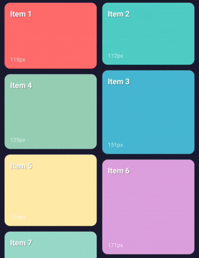

# react-native-draggable-masonry

A draggable masonry grid component for React Native.



## Features

- Masonry layout with variable height items
- Drag and drop reordering
- Customizable appearance and behavior
- Auto-scroll when dragging near edges
- Enter/exit animations support

## Installation

```bash
npm install react-native-draggable-masonry
```

### Peer Dependencies

```bash
npm install react-native-gesture-handler react-native-reanimated
```

Follow the setup instructions for:
- [react-native-gesture-handler](https://docs.swmansion.com/react-native-gesture-handler/docs/installation)
- [react-native-reanimated](https://docs.swmansion.com/react-native-reanimated/docs/fundamentals/installation/)

## Quick Start

```tsx
import { DraggableMasonryList } from 'react-native-draggable-masonry';
import { View, Text } from 'react-native';

const data = [
  { id: '1', height: 100, title: 'Item 1' },
  { id: '2', height: 150, title: 'Item 2' },
  { id: '3', height: 120, title: 'Item 3' },
];

export default function App() {
  return (
    <DraggableMasonryList
      data={data}
      renderItem={({ item }) => (
        <View style={{ height: item.height, backgroundColor: '#f0f0f0' }}>
          <Text>{item.title}</Text>
        </View>
      )}
      columns={2}
      onDragEnd={({ data }) => console.log('New order:', data)}
    />
  );
}
```

## Props

### Base

| Prop | Type | Default | Description |
|------|------|---------|-------------|
| `data` | `T[]` | required | Array of items |
| `renderItem` | `(info) => ReactNode` | required | Render function |
| `keyExtractor` | `(item) => string` | `item.id` | Key extraction function |
| `sortEnabled` | `boolean` | `true` | Enable drag sorting |
| `swapMode` | `boolean` | `false` | Enable swap mode instead of insert mode |

### Layout

| Prop | Type | Default | Description |
|------|------|---------|-------------|
| `columns` | `number` | `2` | Number of columns |
| `rowGap` | `number` | `10` | Gap between rows (px) |
| `columnGap` | `number` | `10` | Gap between columns (px) |

### Drag

| Prop | Type | Default | Description |
|------|------|---------|-------------|
| `dragActivationDelay` | `number` | `300` | Long press duration (ms) |
| `activationAnimationDuration` | `number` | `150` | Drag start animation (ms) |
| `dropAnimationDuration` | `number` | `200` | Drop animation (ms) |
| `overDrag` | `string` | `'both'` | Drag restriction: `'both'`, `'horizontal'`, `'vertical'`, `'none'` |

### Active Item

| Prop | Type | Default | Description |
|------|------|---------|-------------|
| `activeItemScale` | `number` | `1.03` | Scale of dragged item |
| `activeItemOpacity` | `number` | `1` | Opacity of dragged item |
| `activeItemShadowOpacity` | `number` | `0.2` | Shadow opacity |
| `inactiveItemOpacity` | `number` | `1` | Opacity of other items |
| `inactiveItemScale` | `number` | `1` | Scale of other items |

### Auto Scroll

| Prop | Type | Default | Description |
|------|------|---------|-------------|
| `autoScrollEnabled` | `boolean` | `true` | Enable auto-scroll |
| `autoScrollActivationOffset` | `number \| [number, number]` | `150` | Edge threshold (px) |
| `autoScrollSpeed` | `number` | `8` | Scroll speed (deprecated) |
| `autoScrollMaxSpeed` | `number` | `50` | Maximum scroll speed |
| `autoScrollMinSpeed` | `number` | `2` | Minimum scroll speed |
| `autoScrollAcceleration` | `number` | `2.5` | Acceleration curve exponent |
| `autoScrollTargetDuration` | `number` | `0.5` | Target duration to reach edge (seconds) |
| `autoScrollDragThreshold` | `number` | `30` | Minimum drag distance into auto-scroll zone before scrolling starts (px) |

### Virtualization

| Prop | Type | Default | Description |
|------|------|---------|-------------|
| `virtualizationEnabled` | `boolean` | `true` | Enable virtualization for large lists |
| `overscanCount` | `number` | `1` | Screen heights to render outside visible area |
| `dragOverscanCount` | `number` | `3` | Screen heights to render during drag |

### Drop Indicator

| Prop | Type | Default | Description |
|------|------|---------|-------------|
| `showDropIndicator` | `boolean` | `true` | Show drop indicator during drag |
| `dropIndicatorStyle` | `StyleProp<ViewStyle>` | `undefined` | Custom style for drop indicator |

### Animations

| Prop | Type | Default | Description |
|------|------|---------|-------------|
| `itemEntering` | `EntryAnimation` | `undefined` | Enter animation |
| `itemExiting` | `ExitAnimation` | `undefined` | Exit animation |

### Callbacks

| Prop | Type | Description |
|------|------|-------------|
| `onDragStart` | `(params) => void` | Called when drag starts |
| `onDragEnd` | `(params) => void` | Called when drag ends |
| `onOrderChange` | `(params) => void` | Called when order changes |
| `onDragChange` | `(params) => void` | Called when drag changes (position or index) |

### Style

| Prop | Type | Default | Description |
|------|------|---------|-------------|
| `contentContainerStyle` | `StyleProp<ViewStyle>` | `undefined` | Style for scroll view content container |

## Item Type

Items must have `id` and `height` properties:

```ts
interface MasonryItem {
  id: string;
  height: number;
}
```

## License

MIT
